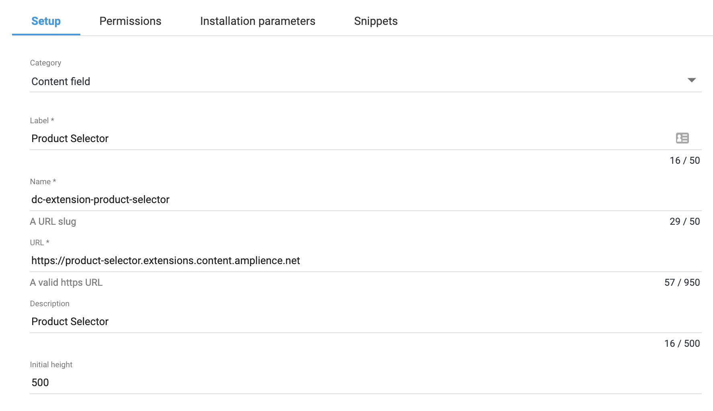

[](https://amplience.com/dynamic-content)

# dc-extension-product-selector


The product selector extension allows content authors to easily search and select products in Salesforce B2C Commerce Cloud (SFCC), SAP Commerce Cloud (Hybris), Commercetools or Kibo Commerce and add them to your content.

The IDs of each product selected are added to the content as an array of strings for SFCC, Commercetools or Kibo Commerce and an array of objects with the id and catalog for Hybris.


The default SFCC backend requires the use of the [sfcc-product-search-proxy)](https://github.com/amplience/sfcc-product-search-proxy) to work around CORS issues when calling the SFCC data endpoint. It is not needed when using with Hybris, Commercetools or Kibo Commerce, or using the `sfcc-cors` backend with the proper configuration.

## How to install

### Register Extension

This extension needs to be [registered](https://amplience.com/docs/development/registeringextensions.html) against a Hub with in the Dynamic Content application (Developer -> Extensions), for it to load within that Hub.



* Category: Content Field
* Label: Product Selector
* Name: dc-extension-product-selector _(needs to be unique with the Hub)_
* URL: [https://product-selector.extensions.content.amplience.net](https://product-selector.extensions.content.amplience.net)
* Description: Product Selector _(can be left blank, if you wish)_
* Initial height: 500

Note:
You can use our deployed version of this extension (builds from the "production" branch) -

[https://product-selector.extensions.content.amplience.net](https://product-selector.extensions.content.amplience.net)

_As this is an open source project you're welcome to host your own "fork" of this project. You can use any standard static hosting service (Netlify, Amplify, Vercel, etc.) if you wish._

#### Permissions


Sandbox permissions:
- Allow same origin

## Installation Parameters


### Customise

| paramerter  |  default  | notes   | required |
|---|---|---|---|
| noItemsText | No items selected. | Placeholder text to display when no items are selected. | false
| searchPlaceholderText  | Search  | Placeholder text to show in the search box.  | false 


### SFCC (cors)

To use this mode, you will also need to ensure that "Allow same origin" is enabled within the [extension's settings](#Permissions), and that the any snippets within content type schemas using this extension reference the extension by its registered name, rather than its URL. Your SFCC instance must also be configured to allow the origin of the hosted extension for the provided client.

By default the extension will use version 21.10 of the Open Commerce API, however this can be overridden with the `sfccVersion` parameter. The extension works with 'list of text' properties and supports the following parameters:

```json
{
  "backend": "sfcc-cors",
  "sfccUrl": "{The URL of the SFCC instance}",
  "sfccVersion": "{The version of OCAPI}",
  "authSecret": "{The SFCC OAuth client secret}",
  "authClientId": "{The SFCC OAuth client ID}",
  "siteId": "{The ID of the site containing products in SFCC}"
}
```

#### Example Snippet

```json
{
  "product selector": {
    "title": "Product Selector",
    "description": "description",
    "type": "array",
    "minItems": 3,
    "maxItems": 10,
    "items": {
      "type": "string"
    },
    "ui:extension": {
      "name": "dc-extension-product-selector",
      "height": 208,
      "params": {
        "backend": "sfcc-cors",
        "sfccUrl": "https://sandbox.demandware.net",
        "sfccVersion": "v21_10",
        "authSecret": "aa1111AAAAAA1",
        "authClientId": "11111111-1111-1111-1111-111111111111",
        "siteId": "TestSite"
      }
    }
  }
}
```

#### Allowing the extension in OCAPI settings

To allow the extension to access product data in your SFCC environment, you will also need to add this to your SFCC OAuth client's `allowed_origins`:

```json
{
  "allowed_origins": [
    "https://product-selector.extensions.content.amplience.net"
  ]
}
```

### SFCC (proxy)

To use this mode, you will need to build and host your own version of [sfcc-product-search-proxy](https://github.com/amplience/sfcc-product-search-proxy). To use this mode as a registered extension, you will also need to ensure that "Allow same origin" is disabled within the [extension's settings](#Permissions). If you reference the extension using `url` this will happen automatically.

The extension works with 'list of text' properties and supports the following parameters:

```json
{
  "proxyUrl": "{The URL of the proxy service}",
  "sfccUrl": "{The URL of the SFCC instance}",
  "authSecret": "{The SFCC OAuth client secret}",
  "authClientId": "{The SFCC OAuth client ID}",
  "siteId": "{The ID of the site containing products in SFCC}"
}
```

#### Example Snippet

```json
{
  "product selector": {
    "title": "Product Selector",
    "description": "description",
    "type": "array",
    "minItems": 3,
    "maxItems": 10,
    "items": {
      "type": "string"
    },
    "ui:extension": {
      "url": "https://product-selector.extensions.content.amplience.net",
      "height": 208,
      "params": {
        "proxyUrl": "https://sfcc-proxy.your-proxy-domain.com",
        "sfccUrl": "https://sandbox.demandware.net",
        "authSecret": "aa1111AAAAAA1",
        "authClientId": "11111111-1111-1111-1111-111111111111",
        "siteId": "TestSite"
      }
    }
  }
}
```

### Hybris

Hybris works with a list of objects with the properties id and catalog and requires the following parameters:

```json
{
  "hybrisUrl": "{URL of your hybris api}",
  "hybrisEndpoint": "{Endpoint for your hybris api (defaults to /rest/v2)}",
  "backend": "hybris",
  "currency": "{Currency of your products defaults to USD}",
  "catalogs": [
    {
      "id": "{ID of catalog}",
      "name": "{Display name of catalog}"
    }
  ]
}
```


#### Example snippet

```json
{
  "title": "title",
  "description": "description",
  "type": "array",
  "items": {
    "type": "object",
    "properties": {
      "id": {
        "type": "string"
      },
      "catalog": {
        "type": "string"
      }
    }
  },
  "ui:extension": {
    "url": "https://product-selector.extensions.content.amplience.net",
    "params": {
      "hybrisUrl": "https://api-hybris.amplience.com",
      "backend": "hybris",
      "catalogs": [
        {
          "id": "test-catalog",
          "name": "test"
        }
      ]
    }
  }
}
```

### Commercetools

The extension works with 'list of text' properties and supports the following parameters:

```json
{
  "backend": "commercetools",
  "apiUrl": "{API URL}",
  "host": "{Auth URL}",
  "projectKey": "{Project key}",
  "clientId": "{Client id}",
  "clientSecret": "{Client secret}",
  "scope": "{Scope of permissions}",
  "locale": "{Locale for text search}"
}
```
Values could be get from creating API Client on Commercetools platform (Settings/Developer settings/Create new API client).
Required minimal scope of permissions is `view_published_products`, choose View/Products (published).
Image to display is selected from attributes of master variant by name `largeImageUrl` or first image in `images` array.

#### Example Snippet

```json
{
  "product selector": {
    "title": "Product Selector",
    "description": "description",
    "type": "array",
    "minItems": 3,
    "maxItems": 10,
    "items": {
      "type": "string"
    },
    "ui:extension": {
      "url": "https://product-selector.extensions.content.amplience.net",
      "height": 208,
      "params": {
        "backend": "commercetools",
        "apiUrl": "https://api.europe-west1.gcp.commercetools.com",
        "host": "https://auth.europe-west1.gcp.commercetools.com",
        "projectKey": "project-amp",
        "clientId": "clientId",
        "clientSecret": "clientSecret",
        "scope": "view_published_products",
        "locale": "en-CA"
      }
    }
  }
}
```
### Kibo Commerce

The extension works with 'list of text' properties and supports the following parameters:

```json
{
  "backend": "kibocommerce",
  "apiHost": "{API Host}",
  "authHost": "{API Auth Host}",
  "clientId": "{Application ID}",
  "sharedSecret": "{Application Secret}"
}
```

- `apiHost` - host of your Kibo API environment
- `authHost` - host for Kibo API authentication, home.mozu.com for Production and Sandbox environments
- `clientId` - Application ID from your Kibo Commerce [Dev Console](https://developer.mozu.com/)
- `sharedSecret` - Application Secret from your Kibo Commerce [Dev Console](https://developer.mozu.com/)

The Kibo Commerce application used for this extension will require "Product Read" behaviors.
Additional guides on setting up a Kibo Commerce application can be found in the [Kibo Commerce docs](https://docs.kibocommerce.com/221803-headless-integrations/1108695-getting-started-headless)

#### Example Snippet

```json
{
  "product selector": {
    "title": "Product Selector",
    "description": "description",
    "type": "array",
    "minItems": 3,
    "maxItems": 10,
    "items": {
      "type": "string"
    },
    "ui:extension": {
      "url": "https://product-selector.extensions.content.amplience.net",
      "height": 208,
      "params": {
        "backend": "kibocommerce",
        "apiHost": "t12345-s12345.sandbox.mozu.com",
        "authHost": "home.mozu.com",
        "clientId": "i7d6294.ProductSelector.1.0.0.Release",
        "sharedSecret": "sharedSecret"
      }
    }
  }
}
```

## Available Scripts

In the project directory, you can run:

### `npm start`

Runs the app in the development mode.<br />
Open [http://localhost:3000](http://localhost:3000) to view it in the browser.

The page will reload if you make edits.<br />
You will also see any lint errors in the console.

### `npm test`

Launches the test runner in the interactive watch mode.<br />

### `npm run build`

Builds the app for production to the `build` folder.<br />
It correctly bundles React in production mode and optimizes the build for the best performance.

The build is minified and the filenames include the hashes.<br />
By default, Create React App produces a build assuming your app is hosted at the server root.  
To override this, specify the homepage in your `package.json`, for example:

`"homepage": "."` <br />
Your app is ready to be deployed!
